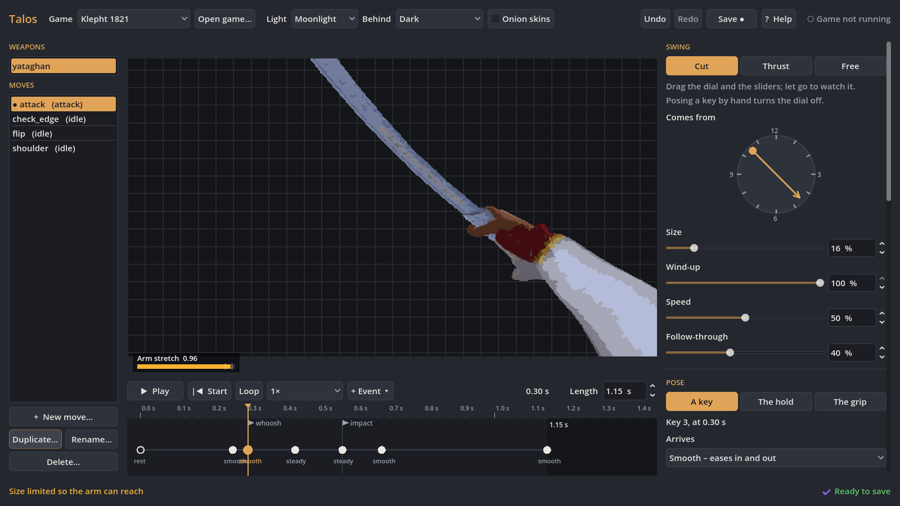
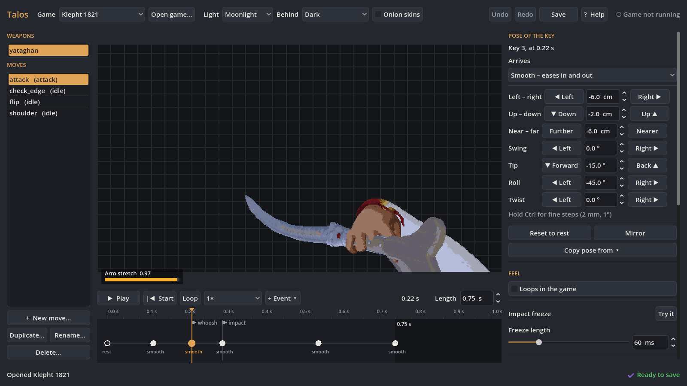
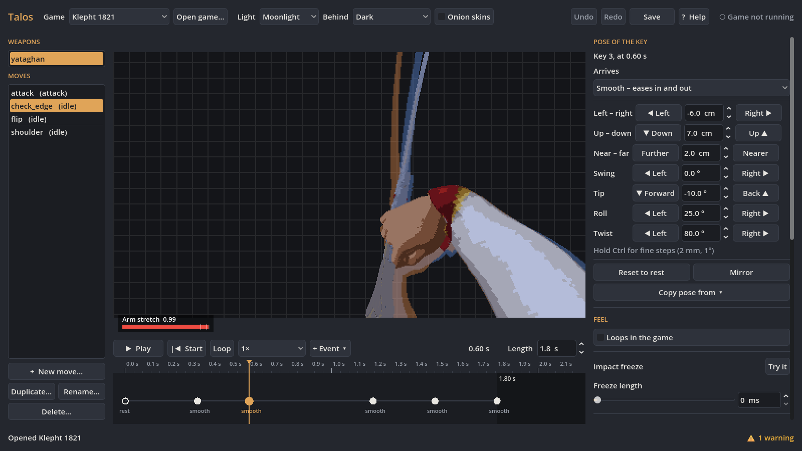

# Talos Animate

**A desktop studio for first-person weapon animation in Godot games.** Built and used in-house for my own
games. This page is a portfolio showcase: the source code and builds are private and are not distributed.

## What it is

Shape a cut or a thrust on a clock dial, refine each pose and its timing on a timeline, tune how the hit
feels, then save a clip the game can play. Talos previews the weapon in Godot itself, and can tell a running
debug build to reload a move the moment it is saved, so the animation is judged in the game rather than in
an editor preview.

| Pose a key | Inspect neighbouring poses |
| --- | --- |
|  |  |

## What it does

- **Shape a move:** pick Cut, Thrust or Free, then set direction, size, wind-up, speed and follow-through.
- **Edit by hand:** pose the weapon with the mouse, keyboard shortcuts, nudge buttons or exact values, with
  the arm following the hand through the runtime's IK.
- **Control timing:** add and retime keys, choose easing, scrub and loop playback, and place impact, whoosh
  or custom events.
- **Tune the feel:** adjust impact freeze, camera kick, FOV punch, blade trail and sound.
- **Work safely:** undo and redo, reach and clip validation warnings, and a backup whenever a move is saved.
- **Try it in the game:** a local debug link reloads and plays a saved move in the running game.

## How it was built

GDScript on Godot 4.7.2, as a desktop editor plus a game-side runtime that plays the clips, drives the rig
and effects, and hosts the local live link. Python handles the converter, sound generation, linting and
tests. The test suite covers GDScript lint and format checks, Python tests and Godot unit tests.

## Status

Version 0.2.1, focused on first-person weapon moves and the swing editor, with Windows as the supported
target. It is in active in-house use on my own Godot projects, including [Klepht: 1821](GAMES.md).

## Availability

Talos Animate was previously published as an open-source download. **It is no longer offered that way.** The
source code and builds are private, and there is no public release, download or support. This page exists so
the work can be seen, not obtained.

Interested in the technology or a collaboration? [Get in touch](mailto:georgekaragioules@gmail.com).

---

[← Software and tools](SOFTWARE.md) · [GitHub profile](https://github.com/gkaragioul) · [georgekaragioules.com](https://georgekaragioules.com/tools)

Screenshots and text © George Karagioules. All rights reserved; no licence is granted to reuse them.
